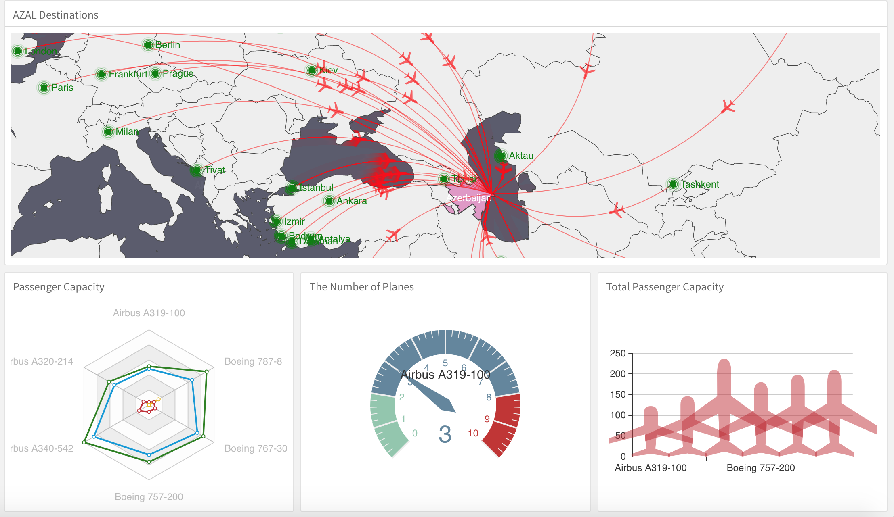

```{r setup, include=FALSE}
knitr::opts_chunk$set(echo = FALSE)
library(dplyr)
library(echarts4r.assets)
library(highcharter)
library(echarts4r)
library(leaflet)
library(ggplot2)
```

&nbsp; &nbsp; &nbsp; &nbsp; Bildiyimiz kimi R-da vizuallaşdırma üçün __ggplot__-dan istifadə edir. Amma dashboard qurulan zamanı qrafiklər dinamik olmalıdıki vizuallaşdırma daha cəlbedici və aydın olsun.

```{r fig.cap="https://dataexperts.shinyapps.io/azal_dashboard/", out.extra="class=external",layout="l-page"}

```

&nbsp; &nbsp; &nbsp; &nbsp; Bu məqsəd üçün R-da çox sayda zəngin JS kitabxanaları mövcuddur:

- [Highcharts](https://www.highcharts.com/)
- [ECHARTS](https://ecomfe.github.io/echarts-examples/public/index.html)
- [Leaflet](https://leafletjs.com/)
- [Wordcloud2](https://github.com/Lchiffon/wordcloud2)
- [və digərləri](http://gallery.htmlwidgets.org/)

## Highcharts

&nbsp; &nbsp; &nbsp; &nbsp; Highcharts-da müxtəlif tipli plotlar yaratmaq olar. Sizlərnən ən orijinal plotları paylaşmaq istəyirəm.

### Streamgraph

&nbsp; &nbsp; &nbsp; &nbsp; Əsasən illər üzrə çox sayda məlumatları əks etdirmək üçün ideal chart növlərindən biridir.

<center>

```{r, echo=T,eval=T,fig.cap=" ", out.extra="class=external",layout="l-page"}
dat <- read.csv(
  "http://asbcllc.com/blog/2015/february/cre_stream_graph_test/data/cre_transaction-data.csv")

hchart(dat, "streamgraph", hcaes(year, volume_billions, group = asset_class)) %>% 
  hc_yAxis(visible = FALSE)%>%
  hc_title(text = "Title")%>%
  hc_xAxis(title = list(text = "Year")) %>%
  hc_yAxis(title = list(text = "Quantity"))%>% 
  hc_credits(enabled=FALSE) %>% hc_size(height = 800) %>% 
  hc_add_theme(hc_theme_superheroes())
```

</center>

### Boxplot

&nbsp; &nbsp; &nbsp; &nbsp; Outlier-ləri vizual olaraq göstərmək üçün. Outlier-ləri ləğv etmək üçün ```outliers = F``` etməlisiniz.

<center>

```{r, echo=T,eval=T,fig.cap=" ", out.extra="class=external",layout="l-page"}
hcboxplot(x = diamonds$x, var = diamonds$color, var2 = diamonds$cut,
          outliers = T) %>% 
  hc_chart(type = "column") %>% 
  hc_add_theme(hc_theme_google())
```

</center>

### Correlation matrix

&nbsp; &nbsp; &nbsp; &nbsp; Verilənlər arasında əlaqənin əks olunması. ```label=T``` etməklə göstəricilərin əks olunmasını bildirmək olar.

&nbsp; &nbsp; &nbsp; &nbsp; Əgər siz digər datada bunu tədbiq etmək istəyirsinizsə, o zaman:

```{r, echo=T,eval=F,fig.cap=" ", out.extra="class=external",layout="l-page"}
df = df %>% mutate_if(is.character,is.factor) %>% mutate_all(as.integer)
hchart(cor(df) %>% round(.,2),label = T)
```

&nbsp; &nbsp; &nbsp; &nbsp; Nümunə:

<center>

```{r, echo=T,eval=T,fig.cap=" ", out.extra="class=external",layout="l-page"}
hchart(cor(mtcars) %>% round(.,2),label = T)
```

</center>


## Echarts

&nbsp; &nbsp; &nbsp; &nbsp; Echarts, R istifadəçilərinə dahada advanced vizuallaşdırma qrafiklərini təqdim edir.

### Radar

<center>

```{r, echo=T,eval=T,fig.cap=" ", out.extra="class=external",layout="l-page"}
df <- data.frame(
  x = LETTERS[1:5],
  y = runif(5, 1, 5),
  z = runif(5, 3, 7)
)

df %>% 
  e_charts(x) %>% 
  e_radar(y, max = 7, name = "radar") %>%
  e_radar(z, max = 7, name = "chart") %>%
  e_tooltip(trigger = "item")
```

</center>

### Liquifill

<center>

```{r, echo=T,eval=T,fig.cap=" ", out.extra="class=external",layout="l-page"}
liquid <- data.frame(val = c(0.6, 0.5, 0.4))

liquid %>% 
  e_charts() %>% 
  e_liquid(val) 
```


</center>


### Mark Points and Lines

&nbsp; &nbsp; &nbsp; &nbsp; Bar plot və Area chartı-ın bir yerdə əks olunması. Bununla yanaşı qrafikdə minimum və ortalama göstəricilərinin əks etdirilməsi.


<center>

```{r, echo=T,eval=T,fig.cap=" ", out.extra="class=external",layout="l-page"}
USArrests %>% 
  dplyr::mutate(
    State = row.names(.),
    Rape = -Rape
  ) %>% 
  e_charts(State) %>% 
  e_area(Murder) %>%
  e_bar(Rape, name = "Sick basterd", x_index = 1) %>% # second y axis 
  e_mark_line("Sick basterd", data = list(type = "average")) %>% 
  e_mark_point("Murder", data = list(type = "min")) %>% 
  e_tooltip(trigger = 'item')
```


</center>


## Leaflet

&nbsp; &nbsp; &nbsp; &nbsp; Bəzən xəritəni müəyyən məqsədlər üçün Markddown-da göstərmək vacib ola bilər. Bunun üçün __leaflet__ kitabxanasından istifadə edə bilərsiniz. ```Latitude, longitude`` dəyişməklə diapazonu rahatlıqda digər istiqamətə yönəldə bilərsiniz.

### Baku

```{r, echo=T,eval=T,fig.cap=" ", out.extra="class=external",layout="l-page"}

leaflet() %>% setView(lng = 49.8, lat = 40.4, zoom = 14)%>%
  addProviderTiles(providers$Esri.WorldImagery) %>%
  addMiniMap(
    tiles = providers$Esri.WorldStreetMap,
    toggleDisplay = TRUE)
```


### Wordcloud (shapes)

&nbsp; &nbsp; &nbsp; &nbsp; Wordcloud isə sözləri bar chartda *primitiv olaraq* əks etdirmək əvəzinə, tag cloud-da daha effektiv göstərmək üçün istifadə olunan qrafiki üsuldur. Sözlərin böyüklüyü tez-tez rast gəlinməsini bildirir. Aşağı hissədə plot-un formaları qeyd olunub.

### 'circle' , 'cardioid' , 'diamond' , 'triangle-forward' , 'triangle' , 'pentagon' , 'star'


<center>

```{r, echo=T,eval=T,fig.cap=" ", out.extra="class=external",layout="l-page"}
library(wordcloud2)

 #figPath = "/Users/turgutabdullayev/Downloads/dataexperts2/tank.png"

wordcloud2(demoFreq, 
           size = 1,
           #figPath = figPath
           shape = 'cardioid')
```

</center>


&nbsp; &nbsp; &nbsp; &nbsp; Və nəhayət yuxarıda göstərilən plotlarla Shiny ilə dashboard qura bilərik.


```{r fig.cap="https://dataexperts.shinyapps.io/azal_dashboard/", out.extra="class=external",layout="l-page"}

```


&nbsp; &nbsp; &nbsp; &nbsp; Shiny-dən istifadə edilməsi qaydalarıyla bu [Tutorial](https://shiny.rstudio.com/tutorial/) vasitəsiylə tanış ola bilərsiniz.

&nbsp; &nbsp; &nbsp; &nbsp; Yaradılan Dashboard-la tanış olmaq üçün aşağıdakı linkdən istifadə edə bilərsiniz.

> https://dataexperts.shinyapps.io/azal_dashboard/


### Application Demo məqsədiylə yaradılıb və AZAL uçuşlarını, təyyarə növlərini və digər məlumatları əks etdirir.


