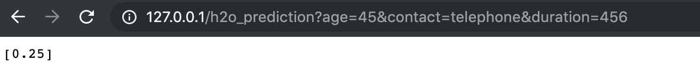

```{r setup, include=FALSE}
knitr::opts_chunk$set(echo = FALSE)
```

&nbsp; &nbsp; &nbsp; &nbsp; Bəzən sistem məhdudiyyəti bizə bir sıra alqoritmlədən istifadə etməyə icazə vermir. Bu problemnən çıxış yolu kimi __Docker__-i nəzərdə tutmaq olar.

&nbsp; &nbsp; &nbsp; &nbsp; Docker virtual olaraq linux sistemi yaradır, həmin sistemin daxilində isə biz istənilən əməliyyatları edə bilərik. Bu postda biz əsas olaraq Docker-də R-ın necə yaradılmasından başlayaraq, sürətli şəkildə AI ilə model qurub Web API-nı portda "run" edəcəyik.
Proses mürəkkəb görsənsədə, əməliyyatlar olduqca sadədir. 

&nbsp; &nbsp; &nbsp; İndi isə keçək birbaşa praktiki addımlara:

### Step 1

İlk olaraq [Docker-i](https://hub.docker.com/?overlay=onboarding) rəsmi saytdan lokala endirin. Qeyd edim ki, endirməni etmək üçün qeydiyyatdan keçmək lazımdır. 

İnstall mərhələsindən sonra Docker-i açın. Bu zaman ekrana ismarıc olaraq __Docker is running__ gəlməlidir 30 saniyə / 1 dəqiqə ərzində.

### Step 2

İkinci addım olaraq lokalda sizə rahat olan istəqamətdə (path, directory) qovluq yaradın və aşağıda qeyd olunan faylları həmin qovluğa yerləşdirin.


### Step 3

Üçüncü mərhələdə əməliyyat sisteminizdə boş fayl yaradın. 
Mac OS və Linux-da Terminal vasitəsilə ``` touch dockerfile ``` əmrini verərək faylı yaradın. Amma bunu etməmişdən qabaq istiqaməti dəyişmək istyirsinizsə ```cd /istiqamət/istiqamət``` əmrindən istifadə edin və daha sonra faylı yaradın.

Windows-da siz Powershell ilə əmrləri verə bilərsiniz. İlk öncə qovluğu yaradıb, daxilində yeni text faylı yaradın və daha sonra genişlənməsini silin:

text_file.txt => text_file~~.txt~~ => text_file

Windows Powershell-də fayl sisteminin istiqamətini dəyişmək üçün ```set-location "C:\istiqamət\istiqamət" əmrindən istifadə edə bilərsiniz.

### Step 4

Yaradılmış ```dockerfile```-ın daxilinə aşağıda qeyd olunan addımları əlavə edərək save etməliyik.

```{r,echo=T,eval=F}

# R mühitini istifadə etmək üçün
FROM rocker/r-ver:3.6.1

# plumber (web api) üçün linux kitabxanaları
RUN apt-get update -qq && apt-get install -y \
  libssl-dev \
  libcurl4-gnutls-dev

# Java 8 install etmək üçün
RUN apt-get install -y --no-install-recommends software-properties-common
RUN add-apt-repository -y ppa:openjdk-r/ppa
RUN apt-get update
RUN apt-get install -y openjdk-8-jdk
RUN apt-get install -y openjdk-8-jre
RUN update-alternatives --config java
RUN update-alternatives --config javac

# R kitabxanaları
RUN R -e "install.packages('plumber')"
RUN R -e "install.packages('dplyr')"
RUN R -e "install.packages('data.table')"
RUN R -e "install.packages('jsonlite')"
RUN R -e "install.packages('RCurl')"
RUN R -e "install.packages('curl')"
RUN R -e "install.packages('h2o',
type='source',repos='https://h2o-release.s3.amazonaws.com/h2o/rel-yau/2/R')"

# bütün faylların serverə köçürülməsi
COPY / /

# port 80-dın açılması
EXPOSE 80

# nəticədə isə aşağıdakı skriptin əks edilməsi
ENTRYPOINT ["Rscript", "controller.R"]

```


İlk öncə sizə mənim qovluğumda olan fayllara nəzər yetirək.

+ calculation.R
+ controller.R
+ dockerfile
+ plumber.R


__Calculation__ skripti modelin qurulmasını, __plumber__ Web API-nın yaradılmasını, __controller__ isə sadalanan 2 faylı özündə əks etdirir, yəni nəticədə biz yalnız CONTROLLER faylından istifadə edərək bütün əməliyyatları icra edəcəyik.

Calculation faylı aşağıdakı kodları əhatə edir.

* datanın yüklənilməsi
* modelin Aİ ilə yaradılması
* modelin yadda saxlanılması

```{r,echo=T,eval=F}

library(dplyr)
df = data.table::fread(
  'https://github.com/jubins/Bank-Marketing-Multivariate-Analysis/raw/master/bank.csv') %>% 
  mutate_if(is.character,as.factor) %>% 
  select(y,duration,contact,age)

library(h2o)
h2o.init()

xgb = h2o.xgboost(y="y",training_frame = df %>% as.h2o(),nfolds = 5)

h2o.saveModel(xgb,path = 'path')

data.table::fwrite(xgb@model_id %>% as.data.frame(),file = 'model_name.csv')


```

Web API üçün nəzərdə tutulan __plumber__ faylı isə aşağıdakı kodları əhatə edir.

* yadda saxlanılan modelin upload edilməsi
* Web API alətinin yaradılması

```{r,echo=T,eval=F}

source('calculation.R')
library(plumber);library(h2o);library(dplyr)
h2o.init()

model_name = data.table::fread('model_name.csv') %>% pull(.)

model = h2o.loadModel(glue::glue("path/{model_name}"))

#* @apiTitle XGBoost from H2O

#* Return the prediction given 3 input features
#* @param duration description for inp1
#* @param contact description for inp2
#* @param age description for inp3
#* @get /h2o_prediction
function( duration,contact,age){
  calc = as.h2o(
    data.frame(duration=as.numeric(duration),contact=as.factor(contact),age=as.numeric(age))
  )
  as.data.frame(h2o.predict(model, calc %>% as.h2o())) %>% .[3] %>% pull() %>% round(.,2)
}


```

Və nəhayət __controller__ isə yuxarıda qeyd olunan Web API-ın port 80-da açılmasını təmin edir.

```{r,echo=T,eval=F}

library(plumber)
r <- plumb("plumber.R")
r$run(port=80, host="0.0.0.0")

```

Və bu qədər, bütün əməliyyatlar bitdi.

Mənim terminalımda icra olunan əməliyyatlara baxa bilərik. Qeyd etmək lazımdır ki, proses ilk dəfə 5-10 dəq vaxt alır, daha sonra isə cache-da olduğu üçün prosesi yenidən başlatmaq üçün bir neçə saniyə bəs edir.

Terminalda icra olunan addımlar:

- ```cd ~/Downloads/docker``` (istiqamətin dəyişilməsi)
- ```docker build -t h2o .``` (təsvirin yaradılması, nöqtə prosesin həmin qovluqda aparılmasını müəyyən edir)
- ```docker run --rm -p 80:80 h2o``` (və run olunması)

```{r,echo=T,eval=F}
Last login: Sat Aug 10 23:59:22 on console
(base) Turguts-MacBook-Pro:~ turgutabdullayev$ cd ~/Downloads/virtual_xgboost
(base) Turguts-MacBook-Pro:virtual_xgboost turgutabdullayev$ docker build -t h2o .
Sending build context to Docker daemon  6.656kB
Step 1/19 : FROM rocker/r-ver:3.6.1
 ---> 8ac8a83e9658
Step 2/19 : RUN apt-get update -qq && apt-get install -y   libssl-dev   libcurl4-gnutls-dev
 ---> Using cache
 ---> 11c9d8feb303
Step 3/19 : RUN apt-get install -y --no-install-recommends software-properties-common
 ---> Using cache
 ---> b1e821e2fc14
Step 4/19 : RUN add-apt-repository -y ppa:openjdk-r/ppa
 ---> Using cache
 ---> 769b9ff5ade9
Step 5/19 : RUN apt-get update
 ---> Using cache
 ---> d81c94adb8eb
Step 6/19 : RUN apt-get install -y openjdk-8-jdk
 ---> Using cache
 ---> 7ff5f805202e
Step 7/19 : RUN apt-get install -y openjdk-8-jre
 ---> Using cache
 ---> ccb005a1141f
Step 8/19 : RUN update-alternatives --config java
 ---> Using cache
 ---> cec90267baf5
Step 9/19 : RUN update-alternatives --config javac
 ---> Using cache
 ---> e4f0eca2090d
Step 10/19 : RUN R -e "install.packages('plumber')"
 ---> Using cache
 ---> 743eacd9fda8
Step 11/19 : RUN R -e "install.packages('dplyr')"
 ---> Using cache
 ---> ac3a82b2141f
Step 12/19 : RUN R -e "install.packages('data.table')"
 ---> Using cache
 ---> 936a0fdc2ec2
Step 13/19 : RUN R -e "install.packages('jsonlite')"
 ---> Using cache
 ---> abbbe40b3448
Step 14/19 : RUN R -e "install.packages('RCurl')"
 ---> Using cache
 ---> 55767f64bcfb
Step 15/19 : RUN R -e "install.packages('curl')"
 ---> Using cache
 ---> 4b878d232d23
Step 16/19 : RUN R -e "install.packages('h2o', type='source', repos='https://h2o-release.s3.amazonaws.com/h2o/rel-yau/2/R')"
 ---> Using cache
 ---> 6dbbf007fc75
Step 17/19 : COPY / /
 ---> Using cache
 ---> 25496fe718a1
Step 18/19 : EXPOSE 80
 ---> Using cache
 ---> 4574025162e0
Step 19/19 : ENTRYPOINT ["Rscript", "controller.R"]
 ---> Using cache
 ---> a610f540daa7
Successfully built a610f540daa7
Successfully tagged h2o:latest
(base) Turguts-MacBook-Pro:virtual_xgboost turgutabdullayev$ docker run --rm -p 80:80 h2o

Attaching package: ‘dplyr’

The following objects are masked from ‘package:stats’:

    filter, lag

The following objects are masked from ‘package:base’:

    intersect, setdiff, setequal, union


----------------------------------------------------------------------

Your next step is to start H2O:
    > h2o.init()

For H2O package documentation, ask for help:
    > ??h2o

After starting H2O, you can use the Web UI at http://localhost:54321
For more information visit http://docs.h2o.ai

----------------------------------------------------------------------


Attaching package: ‘h2o’

The following objects are masked from ‘package:stats’:

    cor, sd, var

The following objects are masked from ‘package:base’:

    &&, %*%, %in%, ||, apply, as.factor, as.numeric, colnames,
    colnames<-, ifelse, is.character, is.factor, is.numeric, log,
    log10, log1p, log2, round, signif, trunc


H2O is not running yet, starting it now...

Note:  In case of errors look at the following log files:
    /tmp/RtmplzYQ5U/h2o_UnknownUser_started_from_r.out
    /tmp/RtmplzYQ5U/h2o_UnknownUser_started_from_r.err

openjdk version "1.8.0_222"
OpenJDK Runtime Environment (build 1.8.0_222-8u222-b10-1~deb9u1-b10)
OpenJDK 64-Bit Server VM (build 25.222-b10, mixed mode)

Starting H2O JVM and connecting: .. Connection successful!

R is connected to the H2O cluster: 
    H2O cluster uptime:         2 seconds 677 milliseconds 
    H2O cluster timezone:       Etc/UTC 
    H2O data parsing timezone:  UTC 
    H2O cluster version:        3.26.0.2 
    H2O cluster version age:    14 days, 20 hours and 55 minutes  
    H2O cluster name:           H2O_started_from_R_root_twr393 
    H2O cluster total nodes:    1 
    H2O cluster total memory:   0.86 GB 
    H2O cluster total cores:    2 
    H2O cluster allowed cores:  2 
    H2O cluster healthy:        TRUE 
    H2O Connection ip:          localhost 
    H2O Connection port:        54321 
    H2O Connection proxy:       NA 
    H2O Internal Security:      FALSE 
    H2O API Extensions:         Amazon S3, XGBoost, Algos, AutoML, Core V3, Core V4 
    R Version:                  R version 3.6.1 (2019-07-05) 

  |======================================================================| 100%
  |======================================================================| 100%
 Connection successful!

R is connected to the H2O cluster: 
    H2O cluster uptime:         28 seconds 294 milliseconds 
    H2O cluster timezone:       Etc/UTC 
    H2O data parsing timezone:  UTC 
    H2O cluster version:        3.26.0.2 
    H2O cluster version age:    14 days, 20 hours and 55 minutes  
    H2O cluster name:           H2O_started_from_R_root_twr393 
    H2O cluster total nodes:    1 
    H2O cluster total memory:   0.84 GB 
    H2O cluster total cores:    2 
    H2O cluster allowed cores:  2 
    H2O cluster healthy:        TRUE 
    H2O Connection ip:          localhost 
    H2O Connection port:        54321 
    H2O Connection proxy:       NA 
    H2O Internal Security:      FALSE 
    H2O API Extensions:         Amazon S3, XGBoost, Algos, AutoML, Core V3, Core V4 
    R Version:                  R version 3.6.1 (2019-07-05) 

Starting server to listen on port 80


```

Brauzerə keçərək nəticəni əldə edə bilərik.

```{r fig.cap=" ", out.extra="class=external",layout="l-body-outset"}

```


Brauzerdəki nəticənin əldə edilməsi aşağıdakı kimidir.

```{r,echo=T,eval=F}
http://127.0.0.1/h2o_prediction?age=30&contact=telephone&duration=459

# h2o_prediction - plumber.R-da olan bu hissədir #* @get /h2o_prediction
# age=30&contact=telephone&duration=459 bu məlumatlar isə datadakı verilənləri əks etdirir.
```


Diqqəniz üçün təşəkkür edirəm! Əgər hər hansı bir sual yaranarsa, aşağı hissədə yaza bilərsiniz.


