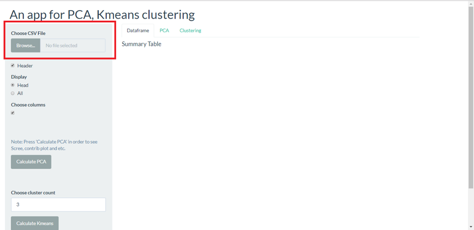
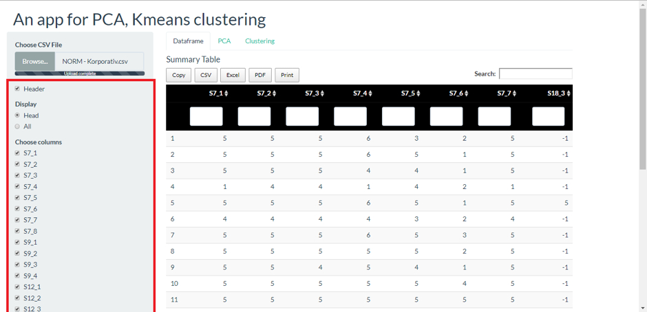
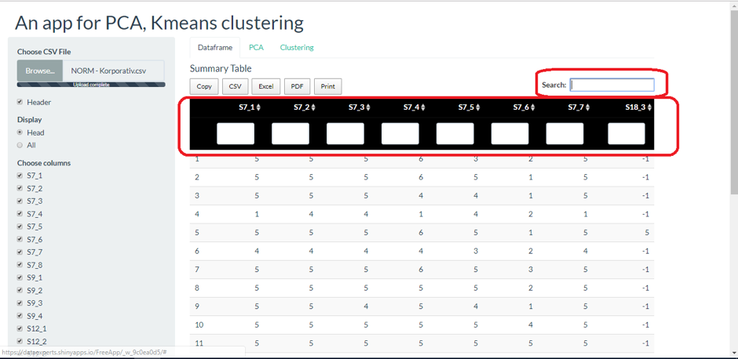
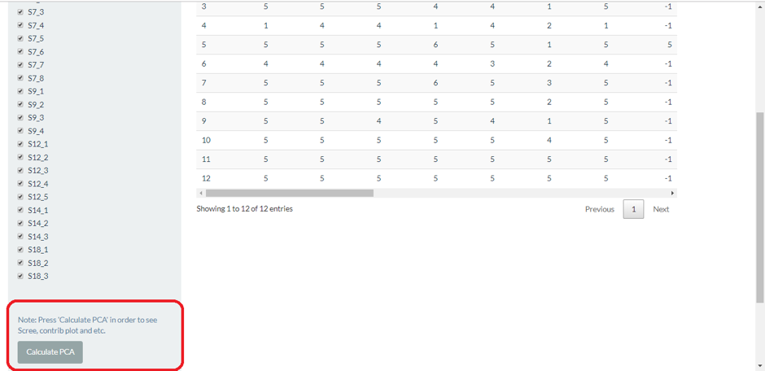
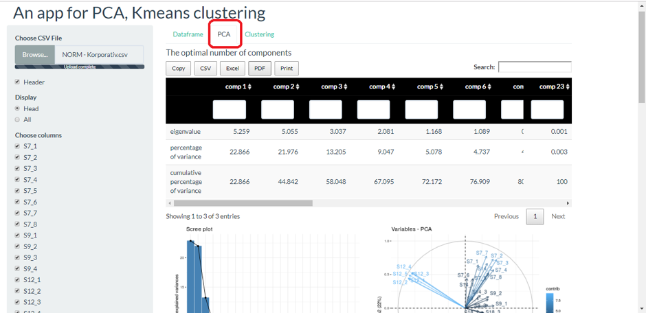
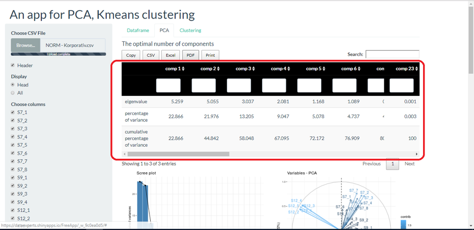
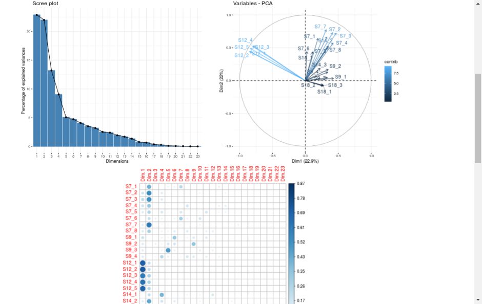
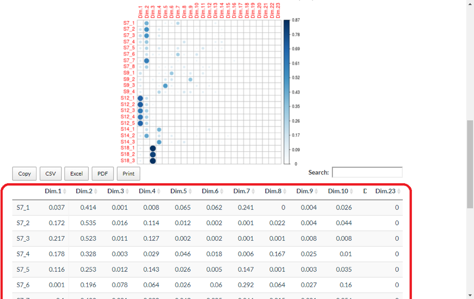

```{r setup, include=FALSE}
knitr::opts_chunk$set(echo = FALSE)
```

&nbsp; &nbsp; &nbsp; &nbsp; Böyük həcmli datalar üçün hazırlanmış bu tətbiq sayəsində kodlaşdırmadan istifadə etmədən data üzərində PCA və Cluster analizlərini asanlıqla edə bilərsiniz. Olduqca sadə interfeysə malik bu tətbiq həm də istifadə baxımında sizə geniş imkan yaradır. Belə ki, sizə analizin nəticəsini bir neçə saniyə içində verəcək: 


- Datanı tətbiqə upload edin
-	Müəyyən etdiyiniz analiz üçün müvafiq düyməyə klikləyin
-	Nəticəni kopyalaya, .csv, .xls, .pdf formatında endirə və ya çap edə bilərsiniz.

> Application-a keçid: https://dataexperts.shinyapps.io/FreeApp/

&nbsp; &nbsp; &nbsp; &nbsp; Bu postda biz böyük sənaye şirkətinin korporativ müştəriləri üçün hazırlanmış müştəri məmnuniyyəti anket sorğusunun nəticələri üzərində  Faktor analizi edəcəyik. Qeyd edək ki, bu data Likert ölçülü datadır və meyarlar 5 ballıq sistemlə qiymətləndirilmişdir.

### Datanın tətbiqə yüklənməsi (loading .csv )

.csv formatında olan datanı tətbiqə daxil edib onun ilkin görünüşü ilə tanış ola bilərsiniz. Bunun üçün **Browse** düyməsi ilə data faylını komputerdən proqrama daxil etməlisiniz.

```{r fig.cap=" ", out.extra="class=external",layout="l-body-outset"}

```


Sol hissədə olan seçimlər vasitəsilə datanın ümumi görünüşünü fərdiləşdirə bilərsiniz.

```{r fig.cap=" ", out.extra="class=external",layout="l-body-outset"}

```


Bundan başqa data yükləndikdən sonra istədiyiniz sütun üzrə filter tətbiq edə və ümumi axtarış verə bilərsiniz.

```{r fig.cap=" ", out.extra="class=external",layout="l-body-outset"}

```


### Datanın analiz edilməsi

&nbsp; &nbsp; &nbsp; &nbsp; Calculate PCA düyməsini kliklədikdən sonra analizin nəticələri PCA bölməsində görünəcəkdir.


```{r fig.cap=" ", out.extra="class=external",layout="l-body-outset"}

```

```{r fig.cap=" ", out.extra="class=external",layout="l-body-outset"}

```


### Nəticənin interpretasiyası

&nbsp; &nbsp; &nbsp; &nbsp; Nəticə hissəsində qarşıya ilk çıxan Faktor analizi ilə bağlı statistiklər olacaqdır.

```{r fig.cap=" ", out.extra="class=external",layout="l-body-outset"}

```


&nbsp; &nbsp; &nbsp; &nbsp; Burada faktorların sayını müəyyən etmək üçün *__eigenvalue__*  sətrinə diqqət yetirsək yalnız 1.0`dan böyük əmsallı faktorlar götürülür. *__Percentage of variance__* sətrinə baxsaq görərik ki, 1-ci faktor ümumi varyansın ən böyük hissəsini əhatə edir. Növbəti faktorların isə özlərindən əvvəlki faktorlarla əlaqəsi yoxdur və yerdə qalan varyansı əhatə edir.

&nbsp; &nbsp; &nbsp; &nbsp; Nəticənin qrafik hissəsində *__Scree plot__* (varyans faizlərinin qrafik təsviri), *__Rotation Biplot__* (faktor matrisinin izah olunmasını daha asan şəklə gətirir) və *__Corr plot__* (dəyişənlərlə faktorlar arasındakı korrelyasiyaları göstərir) görə bilərsiniz.


```{r fig.cap=" ", out.extra="class=external",layout="l-body-outset"}

```

*__Factor matrix__* Bütün dəyişənlərin bütün faktorlar üzərindəki yüklərini göstərir. Matrisdə ən böyük yükləri saxlayıb qalanlarını silirik.

```{r fig.cap=" ", out.extra="class=external",layout="l-body-outset"}

```


### Yekun

Yekun  olaraq onu qeyd etmək olar ki, gələcəkdə Shiny Application biznesin idarə edilməsində böyük yer tutacaq, çünki bu proqram sayəsində Data Analitik olmadan da dataları analiz edərək nəticəni lokala endirə bilərik, çünki interfeys çox sadədir və heç bir kodlaşdırma tələb etmir.

__P.S.__ Tətbiqin gələcəkdə təkmilləşdirilməsi nəzərdə tutulur. Suallarınız və ya hərhansı irad və təklifləriniz varsa aşağı hissədə yaza bilərsiniz.


