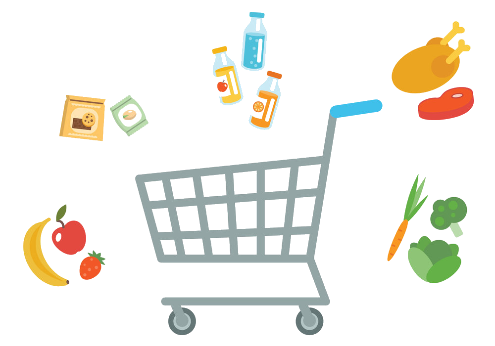
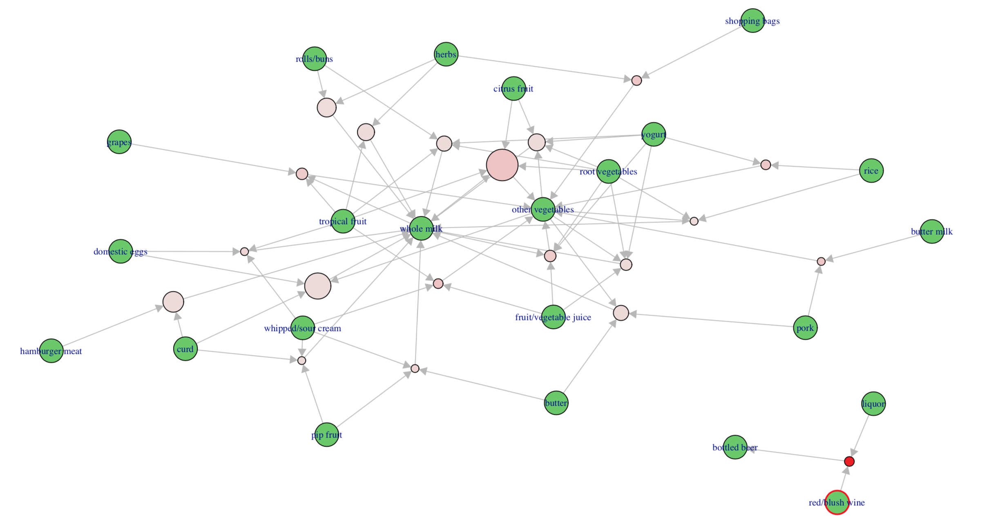

```{r setup, include=FALSE}
knitr::opts_chunk$set(echo = FALSE)
library(highcharter)
library(tidyquant)
library(arules)
library(arulesViz)
library(kableExtra)
library(knitr)
library(DT)
library(bibtex)
library(tidyr)
library(dplyr)
tr <- read.transactions('groceries.csv', format = 'basket', sep=',')
rules <- apriori(tr, parameter = list(supp=0.001, conf=0.8))
rules <- sort(rules, by='confidence', decreasing = TRUE)

df<-read.csv('groceries.csv',sep = ',',
             header = F)

df %>% gather(key = key, value = value) %>% select(value) %>% count(value) %>% .[-1,] %>% 
  mutate_if(is.character,as.factor) %>% arrange(desc(n)) %>% filter(n > 300) %>% .[1:10,]->df_2
df %>% gather(key = key, value = value) %>% select(value) %>% count(value) %>% .[-1,] %>% 
  mutate_if(is.character,as.factor) %>% arrange(desc(n)) %>% filter(n > 300) %>% tail() %>% .[1:6,]-> onions

anti_beans <-read.csv('anti_beans.csv')
```


&nbsp; &nbsp; &nbsp; &nbsp; **Market Basket Analysis** supermarket şəbəkələri, online alış-veriş (Amazon, Ebay), youtube və digər sahələrdə 2 obyekt (kombinasiya + məhsul) arasında müəyyən asosiasiyanın aşkarlanmasında istifadə olunan əsas vasitələrdən biridir. 

<center>

```{r fig.cap=" ",layout="l-page", out.extra="class=external"}

```

</center>

&nbsp; &nbsp; &nbsp; &nbsp; Supermarketlərdə isə bu vasitə bizə 1 tranzaksiya zamanı ən çox alınan mallar kombinasiyasını göstərir. Məsələn süd və meyvə alanlar 90% ehtimalla təbii şirə alacaqlar. "N"" sayda olan bu qanunlar marketi tamamilə reorqanizasiya yəni malların yerlərini dəyişdirməklə satışı effektiv olaraq artırmaq və həmçinin düzgün marketinq strategiyasını (kampaniyalarını) müəyyən edərək profiti artırmaq olar. Bununla yanaşı hətta 2 əmtəənin bir-birinin yanında yerləşməsi onlardan birinin satışını artıra və digərinin isə azalda bilər, buna səbəb isə 2 əmtəənin bir-birinə rəqib olması deməkdir. Əlbətdəki bu qanunları üzə çıxarmaq üçün bizə hər bir tranzaksiya üçün satılan malların siyahısı məlum olmalıdır:


```{r, layout="l-body-outset"}
library(rmarkdown)
paged_table(df)
```


<br/>

__İndi isə deyilənləri dahada yaxşı anlamaq üçün yuxarıda göstərilən market datası (nümunə) ilə tanış olaq.__

<br/>
Ən çox satılan 10 məhsul çoxdan aza doğru aşağıdakı bar-chartda göstərilmişdir.
<br/>

```{r echo=FALSE,fig.width=400, layout="l-screen-inset"}
hchart(df_2,'bar',hcaes(y=n),name='The number of products',colorByPoint=T) %>% hc_xAxis(categories = df_2$value) %>% 
  hc_add_theme(hc_theme_google())%>% hc_credits(enabled=T,text='Turgut Abdullayev') %>% hc_title(text='Top 10 satılan məhsullar')%>% hc_size(width = 650,height = 400)
```
<br/>

**Datanın məzmununa** baxsaq

```{r echo=T,fig.width=10,fig.height=30}
summary(tr)
```
<br/>
<br/>
&nbsp; &nbsp; &nbsp; &nbsp; görərik ki verilən məlumat bazasında 9835 sətr, yəni 9835 tranzaksiya və həmçinin 169 unikal məhsul mövcuddur. Ən çox satılan isə whole milk (süd), other vegetables (tərəvəz), rolls/buns (Saika - çörək), soda (soda) və yogurt (yoqurt) məhsullarıdır.
Ümumilikdə 410 qanun, yəni kombinasiya mövcuddur. Xatırladım ki, qanun deyəndə bir neçə alınan məhsulların digər hər hansı bir məhsulun müştərilər tərəfindən alınma ehtimalını göstərir. Məsələn çörək və tərəvəz alanlar həmçinində süd alacaqlar. 
<br/>

__{çörək, tərəvəz} => süd__

<br/>
Bu qanunları biz bir-bir analiz edərək artıq məhsulların yerini dəyişə və həmçinin reklamların, aksiyaların hansı istiqamətdə olmağını müəyyən edə bilərik. Bu isə artıq yeni bir marketinq strateqiyası deməkdir.
<br/>
<br/>
Aşağıdakı qrafikə fikir versək, görərik ki soldan sağa məhsullar paylanıb. Sol tərəfdə olan məhsullar tez-tez müştərilər tərəfindən alınan kombinasiyanı (məhsul 1 + məhsul 2 + məhsul N) əks etdirir, sağ isə sol tərəfdə alınan məhsulların sağdakı məhsulu alma ehtimalını göstərir. Məsələn qrafikə diqqət yetirsək görərik ki, düyü və qənd alan __süd__; konserv balıq və gigiyena məhsulları alanlar da __süd__ almağa meyillidirlər.

```{r echo=FALSE,fig.width=400, layout="l-screen-inset"}
hchart(anti_beans, "sankey", hcaes(from = lhs, to = rhs, weight = lift),name='lift')%>%
  hc_yAxis(visible = TRUE)%>%
  hc_title(text = "Top 20 rules out of 410")%>%
  hc_add_theme(hc_theme_google())%>% hc_credits(enabled=T,text='Turgut Abdullayev') %>% hc_size(width = 650,height = 500)
```

<br/>
<br/>
Yuxarıdakı bar chartda yalnız __TOP 20__ qanun göstərilmişdir. Belə qanunların sayı 100 min və ya bu rəqəmdən artıqda ola bilər. Bu zaman biz qanunları nəzərə alaraq marketinq strategiyasını tamamilə dəyişdirə bilərik.
<br/>
<br/>
İnteraktiv plot isə bizə datanı dahada yaxşı anlamağa imkan yaradır. Məsələn aşağı sol tərəfə baxsaq, görərik ki _şor (curd) və ət (hamburger meat) alanlar həmçinində süd (whole milk) almağa meyillidirlər_.

```{r layout="l-body-outset"}

```

<br/>

__Qrafiki təsviri html vasitəsi ilə canlı olaraqda göstərə bilərik.__ Mouse vasitəsi ilə spesifik məhsulu və ya qanunu seçməkdə mümkündür.

```{r echo=FALSE,fig.width=10,fig.height=10}
plot(rules[1:20], method = "graph",  engine = "htmlwidget")
```

<br/>

Qeyd edilən kombinasiyaya vizuallaşdırma olmadan aşağıdakı formada baxmaq olar:

<br/>
```{r echo=FALSE,fig.width=10,fig.height=30}
inspect(rules[371])
```
<br/>

- __Support__ datada bu tipli tranzaksiyaların hissəsini göstərir, yəni 100% datanın 0.002 hissəsi (bu tipli tranzaksiya sayı = 25). <br/>
- __Confidence__ qanunun yeni tranzaksiya üçün ehtimalını göstərir, yuxarıda göstərilən üçün 81%-dir. <br/>
- __Lift__ isə 1 dən artıq olmalıdır, çünki yalnız bu zaman onların bir-birinə rəqib olmadığını və əksinə bir-birindən asılı olduğunu bildirir. Əks halda kombinasiya və məhsulun yerləri tamamilə fərqli olmalıdır (lift < 1). Əgər Lift = 1, bu zaman verilən əlaqədən heç bir qanun çıxarmağın mümkün olmaması deməkdir.

<br/>

Datada mövcud olan qanunları həmçinində matris formasında əks etdirmək mümkundür. Ətraflı məlumat əks etdirilməsə belə, biz məlumatları dəfərlə sadələşdirib asanlıqla başa düşə bilərik.

<br/>
```{r echo=FALSE,fig.width=10,fig.height=10}
plot(rules, method = "grouped")
```


<br/>

**Nəticədə, Market Basket Analysis (MBA) bizə bir sıra məsələlərdə köməklik edə bilər:**

- Tez-tez alınan məhsulların siyasını üzə çıxararaq supermarketin reorqanizasiyası (yenidən qurulması) <br/>
- Yeni reklam kampaniyalarının qanunlara uyğun olaraq əsaslandırılaraq  yaradılması <br/>
- Mövcud olan qanuların köməyi ilə müştərilərin daha çox məhsul almağa cəlb edilməsi <br/>
- Reklam olunan məhsulların marjası əsasən aşağı olur, buna görədə marjası yüksək olan əmtəələrin marjası aşağı olanlarla bir kombinasiyada təklif olunması satışların effektiv olaraq artırılmasına kömək edə bilər


