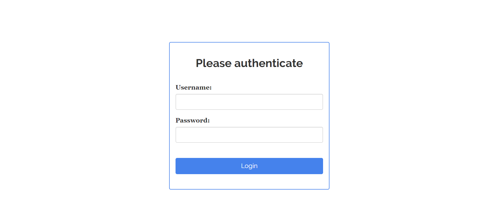
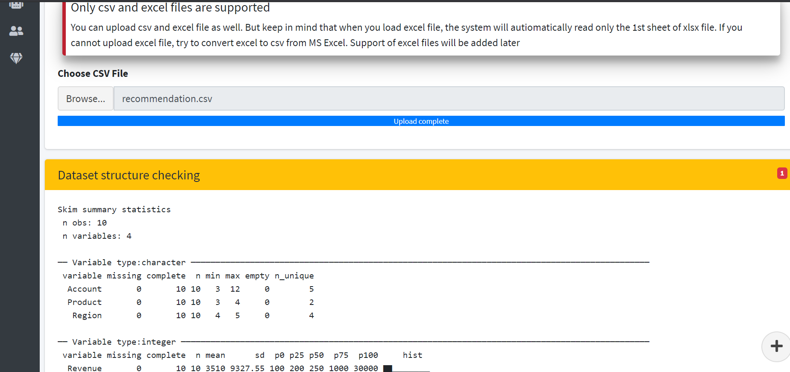
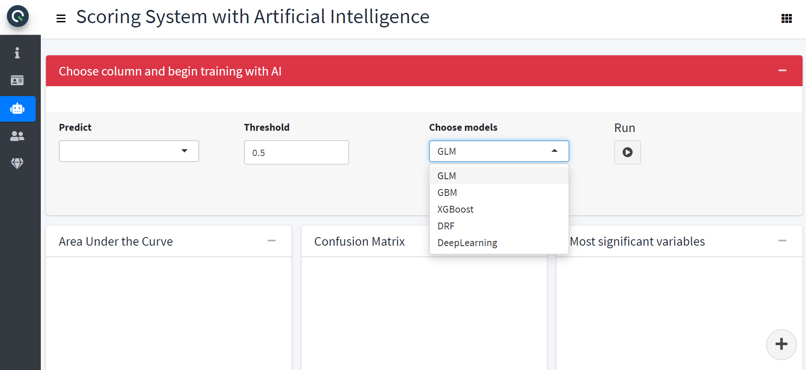
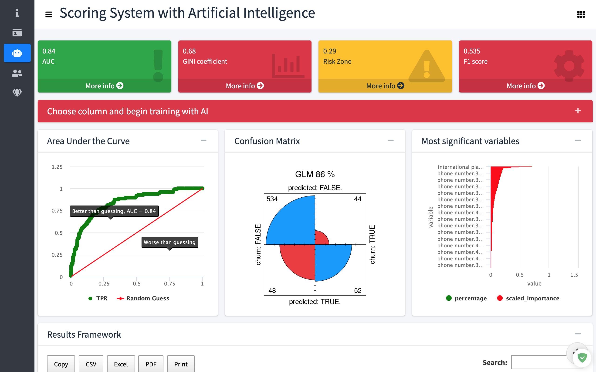

```{r setup, include=FALSE}
knitr::opts_chunk$set(echo = FALSE)
```

## Intro

Building a powerful web application in R requires knowledge of R, Shiny framework, and a bit of CSS, HTML. R skills are enough for building the structure of the app, but it is not enough to make an app beautiful and much more user-friendly.

In this post, we would like to present an application which is very helpful for companies to build a model without a knowledge/experience in data science. 

## Authentication

Authentication allows to limit an access to your application. Here you can even set limited time in access to your application. So, it is very useful to include such feature to your application and prevent extensive traffic to your server.

```{r, eval=TRUE, echo=FALSE, layout="l-body-outset", fig.cap = " "}

```

## What you need to do

Upload your data via "Browse". This section will quickly read your data but keep in mind that it is better to upload file in a ```csv``` format because excel files can be very slow in reading process. As soon as one uploads a csv file, the app will immediately show the summary of the dataset. Summary covers very useful information about:

- the percentiles of numeric columns
- unique values of categorical features
- the histograms
- and etc.

```{r, eval=TRUE, echo=FALSE, layout="l-body-outset", fig.cap = " "}

```

## Train different models

In order to begin the training process one should choose the column which needs to be predicted. But there is also a menu for choosing an algorithm and at the same time to point out whether a user wants to stack the models or not.

```{r, eval=TRUE, echo=FALSE, layout="l-body-outset", fig.cap = " "}

```


## Result

For now the system itself decides the approximate time for training a model(s). The main criteria is the size of dataset, particularly the row and column numbers of the data.

This page covers a lot of valuable information:

- AUC
- Gini
- the result of CV folds
- Cutoff point 
- and etc.

```{r, eval=TRUE, echo=FALSE, layout="l-body-outset", fig.cap = " "}

```

## Further improvements

In the future we plan to add the number of models that user wants to build. Furthermore, an ability to get an automatic report of the results of the modeling would be very useful and effective for non-technicians. We plan to knit a report in the form of HTML, Word, PDF, and Power Point.

If you have suggestions or would like to test the application, please let us know by writing a comment below.

