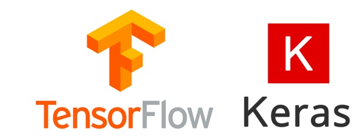

```{r setup, include=FALSE}
knitr::opts_chunk$set(echo = FALSE)
```

&nbsp; &nbsp; &nbsp; &nbsp; Data Experts bloqu sizlərə [Keras](https://keras.rstudio.com/) ilə müxtəlif neyron şəbəkələri (məs. LSTM, RNN, Multilayer perceptron, GRU, CNN və s.) yaratmağa və həmçinin onların vasitəsi ilə spesifik problemlərin necə həll edilməyini öyrədəcəkdir. __Biznes__ problemlərindən başlayaraq — attrition, default, churn, forecasting; __image classification__, __text classification__ və digər oxşar mövzular ilə yaxından tanış olmaq imkanınız olacaqdır.


&nbsp; &nbsp; &nbsp; &nbsp; Bununla yanaşı bəzi məqalələr vizuallaşdırma, data üzərində xüsusi əməliyyatlardan (təmizlənməsi, tamamilə transformasiyası, funksiyaların yazılması və s.) ibarət olacaqdır.




